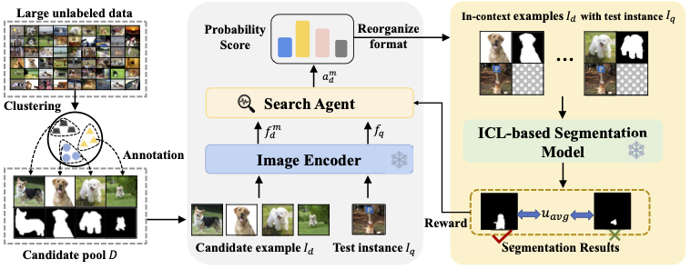

# Visual Prompt Selection for In-Context Learning Segmentation [](https://arxiv.org/pdf/2407.10233.pdf) 
This repository is the implementation of the paper, for more info about this work see [Project Page](https://arxiv.org/pdf/2407.10233.pdf). 

<div align="center">
  
</div>

## Abstract
As a fundamental and extensively studied task in computer vision, image segmentation aims to locate and identify different semantic concepts at the pixel level. Recently, inspired by In-Context Learning (ICL), several generalist segmentation frameworks have been proposed, providing a promising paradigm for segmenting specific objects. However, existing works mostly ignore the value of visual prompts or simply apply similarity sorting to select contextual examples. In this paper, we focus on rethinking and improving the example selection strategy. By comprehensive comparisons, we first demonstrate that ICL-based segmentation models are sensitive to different contexts. Furthermore, empirical evidence indicates that the diversity of contextual prompts plays a crucial role in guiding segmentation. Based on the above insights, we propose a new stepwise context search method. Different from previous works, we construct a small yet rich candidate pool and adaptively search the well-matched contexts. More importantly, this method effectively reduces the annotation cost by compacting the search space. Extensive experiments show that our method is an effective strategy for selecting examples and enhancing segmentation performance.

## Dataset preparation

Our evaluation pipeline is based on [Volumetric Aggregation Transformer](https://github.com/Seokju-Cho/Volumetric-Aggregation-Transformer). Please follow the dataset preparation steps for PASCAL-5i dataset in this repository. 

## Prerequisites
Pytorch installation, set cudatoolkit to your cuda version or choose an installation using these [instructions](https://pytorch.org/get-started/previous-versions/#v18).
```
conda install pytorch==1.9.0 torchvision==0.10.0 torchaudio==0.9.0 cudatoolkit=11.3 -c pytorch -c conda-forge
```
Other dependencies are provided in `requirements.txt`, install them by:
```
pip install -r requirements.txt
```

## Train:
The following runs the training of visual prompt selection, noted that visual backbone was initialized with the weights of "vit_large_patch14_clip_224.laion2b_ft_in12k_in1k":

```
python train.py \
      --model seggpt_vit_large_patch16_input896x448 \
      --engine_ckpt_path <ICL_model_ckpt_path> \
      --cluster_num <cluster_num> \
      --sample_num <sample_num> \
      --fold <data_fold> \
      --BENCHMARK <dataset_name> \
      --output_root <outputs_dir> 
```

## Inference

```
python test.py \
      --model seggpt_vit_large_patch16_input896x448 \
      --engine_ckpt_path <ICL_model_ckpt_path> \
      --cluster_num <cluster_num> \
      --shot <prompt_num> \
      --fold <data_fold> \
      --BENCHMARK <dataset_name> \
      --output_root <outputs_dir> \
      --ckpt_projector_path <project_ckpt_relative_path> \
      --ckpt_predictor_path <predictor_ckpt_relative_path> 
```

## Citations

If you found our work useful, please consider citing our paper:

```bibtex
@inproceedings{Suo2024VisualPS,
  title={Visual Prompt Selection for In-Context Learning Segmentation},
  author={Wei Suo and Lanqing Lai and Mengyang Sun and Hanwang Zhang and Peng Wang and Yanning Zhang},
  year={2024},
  url={https://api.semanticscholar.org/CorpusID:271213205}
}
```

## Acknowledgement
[visual_prompting](https://github.com/amirbar/visual_prompting), [SegGPT](https://github.com/baaivision/Painter/tree/main/SegGPT), [SAM](https://github.com/facebookresearch/segment-anything), [Matcher](https://github.com/aim-uofa/Matcher) and [Personalize-SAM](https://github.com/ZrrSkywalker/Personalize-SAM).

## License

This project is licensed under the terms of the [Apache 2.0](LICENSE) open source license. Please refer to [LICENSE](LICENSE) for the full terms.
